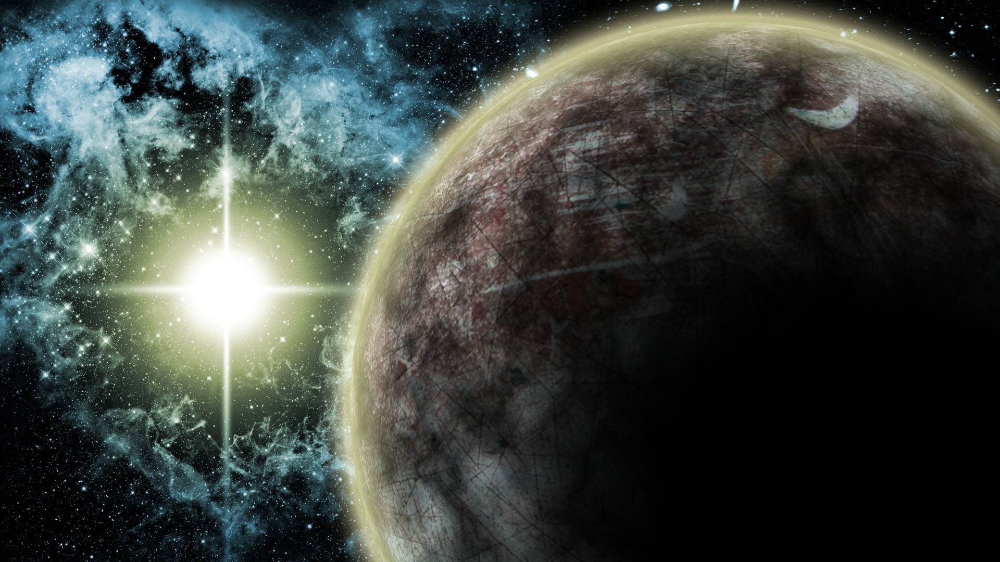
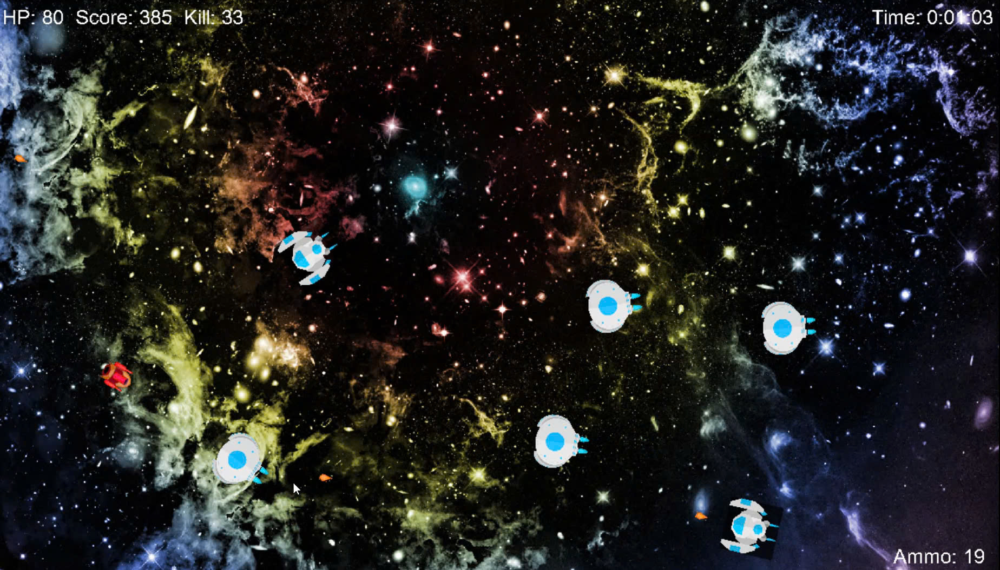
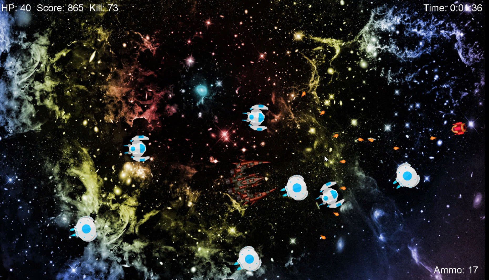
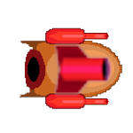
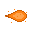
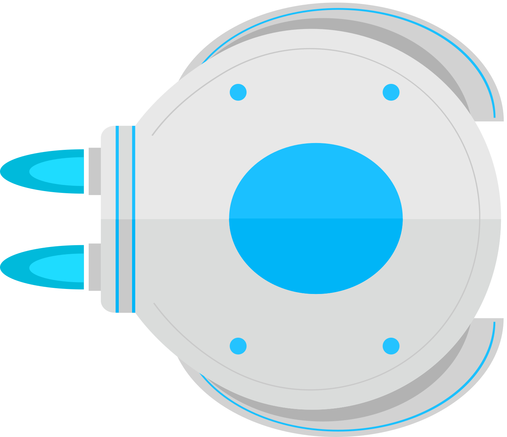
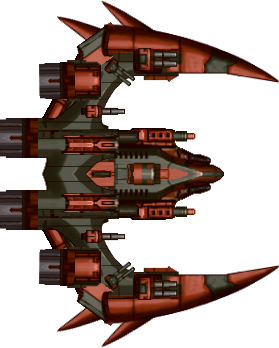

# Shooting Spaceship

* chạy demo: https://drive.google.com/drive/u/4/folders/1toQcGnyA81u-XOkXXnRfYulvN_dO8ZL8?dmr=1&ec=wgc-drive-globalnav-goto
## :statue_of_liberty:Giới thiệu về game
- Shooting Spaceship là 1 game thuộc thể loại Arcade game. Đắm mình vào cuộc chiến giữa con người và các thế lực bên ngoài, bạn hãy cố gắng hết sức để tiêu diệt càng nhiều kẻ địch càng tốt, chỉ bằng những vũ khí đơn giản.

## :point_right:Link tải game
https://github.com/Doannn27/gg/releases

## 👨‍💻 Tác giả

- GitHub: [Doannn27](https://github.com/Doannn27)
## 🎮Cách chơi 
*khi mọi thứ đều hướng ánh mắt về bạn*
- Sử dụng các phím W A S D để di chuyển:runner:, chuột trái để bắn 🏹, phím R để nạp đạn🔫
- lời khuyên: đừng bao giờ phí đạn :smirk:
              Hãy di chuyển thật khéo léo để tránh các cuộc tấn công của kẻ thù,
- Và đừng nghĩ mình là Faker 🗿
## 1. Bắt đầu game

## 2. Gameplay

## 3. Các thành phần
- Player: di chuyển đa hướng, mục đích tiêu diệt kẻ thù

- Bullet: đạn bắn

- Enemy: những kẻ thù cơ bản và nâng cao hơn, cản trở thù địch với player

- Boss: Tàu mẹ, quái khủng có độ khó cao

## 4. Hệ thống lưu điểm
Mỗi khi bạn đạt được 1 điểm số, hệ thống sẽ lưu lại và theo dõi người chơi. Nó sẽ liên tục cập nhật điểm số cao nhất mà bạn đạt được
## 5. File
Folder assets chứa tất cả hình ảnh và âm thanh của game, được chia nhỏ hơn bên trong
## 6. Mô tả hoạt động
- Khi bắt đầu game, mất khoảng 2s để load game. Sau đó sẽ vào menu, gồm có các nút chức năng như bắt đầu, thoát, và xem điểm số
- Bắt đầu màn chơi, người chơi được spawn ở chính giữa màn hình, sở hữu 100 độ bền, trang bị 20 viên đạn và có thời gian tính giờ, bảng đếm điểm, chỉ số kẻ thù tiêu diệt. Kẻ địch sẽ được spawn ở 1 vị trí bất kì, không thể đoán trước được. Có nhiều loại kẻ địch như: kẻ địch chỉ có thể di chuyển, hoặc kẻ địch có thể bắn đạn vào player. Ngoài ra khi đạt đến số lượng tiêu diệt nhất định, Boss sẽ xuất hiện với độ bền RẤT CAO và vô cùng mạnh mẽ. Để có thể tiêu diệt được 1 con Boss là điều vô cùng khó khăn.
- Người chơi sẽ tấn công theo hướng là vị trí hiện tại của con chuột, bằng cách nhấn chuột trái, kết hợp di chuyển bằng wasd. Khi đạn bắn trúng kẻ địch, kẻ địch sẽ biến mất (đối với quái thường) kèm theo đó đạn cũng biến mất. Mỗi loại kẻ địch sẽ cho điểm số nhất định.
- Đối với kẻ địch có thể tấn công từ xa, nó có thể tấn công người chơi bằng cách bắn đạn theo chu kì, mỗi viên đạn gây thiệt hại 10 độ bền.
- Các kẻ địch trong này đều rất đặc biệt, đó là luôn hướng mặt về phía player, và ngoại trừ Boss, tất cả kẻ địch sẽ luôn di chuyển về hướng của player
- Có vẻ như độ khó game khá cao, nên player cũng sẽ có những kỹ năng đặc biệt, chẳng hạn player sẽ được sửa chữa và phục hồi độ bền khi tiêu diệt 1 lượng kẻ địch. Và khi Boss xuất hiện, player cũng sẽ được phục hồi.
- Hệ thống highscore sẽ tự động lưu lại điểm sổ cao nhất của bạn, giúp bạn biết được "trình độ" của mình cũng như độ khó của game là như thế nào.

*ý tưởng game lấy từ tự game vô cùng quen thuộc: Bắn Gà*
*ảnh và âm thanh được lấy tham khảo từ trang https://opengameart.org, trong đó thì có ảnh của player là mình tự vẽ 😃*-

*ý tưởng game lấy từ tự game vô cùng quen thuộc: Bắn Gà.
trên tư tưởng đó mình muốn tạo 1 con game hấp dẫn hơn, và cũng thật khó hơn để tất cả mọi người có thể cảm nhận niềm vui khi chơi những tựa game khó*
